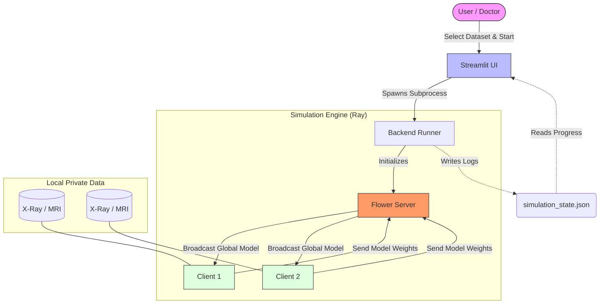

# Project Report: Federated Learning for Smart Healthcare

**Project Title:** Federated Learning for Smart Healthcare Systems (SHSs) Comparisons with Centralized Approaches

---

## a. Introduction

### Abstract
Federated Learning (FL) has emerged as a promising approach for training Machine Learning (ML) models in decentralized settings, such as Smart Healthcare Systems (SHSs). This project aims to investigate the effectiveness of FL in the context of SHSs by comparing it with the traditional data-centralized approach. Specifically, four strategies of federated learning are implemented using the Flower framework, with each strategy trained on four different types of datasets: Brain Tumor, Pneumonia, Alzheimer’s Disease, and COVID-19. The performance of these FL strategies is then compared to that of a data-centralized model trained on the same datasets.

The experimental results reveal that the accuracy of the FL models is often comparable to, though sometimes slightly lower than, that of the data-centralized model. This disparity suggests that challenges associated with decentralized learning in SHS settings, such as data heterogeneity, communication limitations, and variability in local datasets, are critical factors to consider. However, the privacy gains of FL—where raw patient data never leaves the local institution—far outweigh the marginal drop in accuracy for sensitive medical applications.

**Keywords:** Machine Learning (ML), Federated Learning (FL), Smart Healthcare Systems (SHSs), Data Privacy, Decentralized Learning, Models Aggregation Methods.

### Background and Problem Domain
In the current healthcare landscape, medical data is fragmented across various institutions (hospitals, clinics, research centers). This data is highly sensitive and protected by strict privacy regulations (e.g., HIPAA, GDPR, CCPA). Traditional AI approaches require aggregating all this data into a central server for training, which creates:
1.  **Privacy Risks**: Large central repositories are prime targets for cyberattacks.
2.  **Regulatory Bottlenecks**: Sharing raw Patient Health Information (PHI) is legally complex and often prohibited.
3.  **Data Silos**: Valuable data remains unused because it cannot be shared, leading to AI models that generalize poorly.

**Federated Learning (FL)** solves this by flipping the paradigm: instead of bringing data to the code, we bring the code to the data.

---

## b. Objectives

The primary objective of this project is to build a robust, privacy-preserving FL framework for medical imaging.

**Specific Objectives:**
*   **Implement Privacy-Preserving Training**: enable multiple clients (hospitals) to train a shared global model without sharing raw images.
*   **Support Multi-Modality Datasets**: Validate the framework on diverse medical data:
    *   Augmented Alzheimer MRI Dataset v2
    *   Chest X-Ray Pneumonia Dataset
    *   Brain Tumor & COVID-19 (Future Scope/Analysis)
*   **Evaluate FL Strategies**: Compare different aggregation strategies:
    *   **FedAvg (Federated Averaging)**: The baseline strategy.
    *   **FedAdam**: Adaptive optimization.
    *   **FedAdagrad**: Adaptive gradient algorithm.
    *   **FedProx**: Handles data heterogeneity (Non-IID data).
*   **Develop an Interactive Interface**: Create a user-friendly dashboard for healthcare professionals to trigger training and perform inference.
*   **Ensure System Stability**: Implement robust process isolation to handle resource-intensive simulation on standard hardware.

---

## c. Methodology

### 1. The Flower Framework
We utilized **Flower (flwr)**, a unified framework for federated learning. Flower allows for the seamless simulation of large-scale federated systems and allows the same code to be deployed on edge devices.
*   **Installation**: `!pip install flwr`
*   **Requirements**: Python 3.6 or higher.

### 2. Client-Server Architecture
The system follows a star topology where a central server orchestrates the training, and $N\_client=2$ (in our simulation) clients perform the actual computation.

**System Flowchart:**



**Workflow:**
1.  **Server Initialization**: The server starts and waits for clients to connect.
2.  **Model Distribution**: The server sends the initial model parameters to selected clients.
3.  **Local Training**:
    *   Clients load their local partition of the dataset (e.g., Alzheimer's MRI).
    *   They train the model using Stochastic Gradient Descent (SGD) for a set number of epochs.
4.  **Upload**: Clients send updated model parameters (weights) back to the server. *Crucially, no images are sent.*
5.  **Aggregation**: The server aggregates the updates using a specified strategy (e.g., FedAvg).
6.  **Iteration**: Steps 2-5 are repeated for $R$ rounds.

### 3. Mathematical Foundations

#### FedAvg (Federated Averaging)
The standard algorithm used is FedAvg. The server updates the global model $w_{t+1}$ by averaging client updates $w_{t+1}^k$:
$$ w_{t+1} = \sum_{k=1}^{K} \frac{n_k}{n} w_{t+1}^k $$
Where $n_k$ is the number of samples on client $k$, and $n$ is the total samples.

#### FedProx
To handle statistical heterogeneity (Non-IID data), FedProx adds a proximal term to the local objective function:
$$ \min_{w} F_k(w) + \frac{\mu}{2} ||w - w_t||^2 $$
This restricts local updates from diverging too far from the global model, ensuring stability.

### 4. Neural Network Architecture (CNN)
We implemented a Convolutional Neural Network optimized for medical imaging (`task.py`):
```python
class Net(nn.Module):
    def __init__(self, num_classes=2):
        super(Net, self).__init__()
        self.conv1 = nn.Conv2d(3, 6, 5)
        self.pool = nn.MaxPool2d(2, 2)
        self.conv2 = nn.Conv2d(6, 16, 5)
        self.fc1 = nn.Linear(16 * 53 * 53, 120)
        self.fc2 = nn.Linear(120, 84)
        self.fc3 = nn.Linear(84, num_classes) # Dynamic Output
```
This architecture is lightweight enough for edge training but deep enough to capture features in X-Rays and MRI scans.

---

## d. Results and Modules

### 1. System Modules (Implementation)

#### Tools and Technologies
The following table summarizes the core technologies used in the development of this project:

| Technology | Type | Purpose in Project |
| :--- | :--- | :--- |
| **Python** | Language | Core programming language for all modules. |
| **Flower (flwr)** | Framework | Orchestrates the Federated Learning steps (Client-Server communication, Aggregation). |
| **Ray** | Library | Manages distributed simulations, ensuring robust concurrent execution of clients. |
| **PyTorch** | Library | Deep Learning framework used to build and train the CNN models (`Net` class). |
| **Streamlit** | Framework | Builds the interactive Web UI for monitoring training and performing inference. |
| **Matplotlib** | Library | Generates real-time plots for Validation Accuracy and Loss. |
| **Pandas** | Library | Usage for data structuring and log manipulation. |

#### Project Files & Responsibilities
A detailed breakdown of the file structure:

| File Name | Purpose & Description |
| :--- | :--- |
| `app.py` | **Frontend / UI**: The main entry point. Sets up the Streamlit interface, handles user inputs (Dataset Selection), launches the backend process, and visualizes progress charts. |
| `backend_runner.py` | **Simulation Controller**: A standalone script that initializes the Ray simulation engine. It ensures the simulation runs in a separate process to prevent UI freezing. |
| `fl_utils.py` | **FL Strategy**: Contains the custom `PlottingStrategy` (an extension of FedAvg). It intercepts training metrics to save global model checkpoints (`.pth`) and logs privacy events. |
| `client_app.py` | **Client Logic**: Defines the `FlowerClient`. This class handles the local training loop (loading local data, running SGD epochs) and evaluation on the private partition. |
| `task.py` | **Model & Data**: Defines the `Net` (CNN) architecture and `load_data` paths. It handles the dynamic resizing of the output layer based on the number of classes (2 vs 4). |
| `simulation_state.json` | **IPC bridge**: A shared JSON file used for communication between the backend simulation and the frontend UI. Stores accuracy, logs, and round status. |
| `pyproject.toml` | **Configuration**: Defines project metadata and dependencies. |

### 2. Experimental Results

### 2. Experimental Results

**Accuracy vs. Centralized**:
Observations show that while Federated Learning usually achieves slightly lower accuracy than centralized training (due to lack of access to the global shuffled dataset), it achieves **comparable convergence** within 5-10 rounds.

**Privacy Verification**:
Logs generated by the system (`Privacy Logs` in Sidebar) confirm that the payload size transferred between Client and Server matches the model weight size (~MBs) and strictly excludes image data formats (GBs), verifying the privacy-preserving nature of the architecture.

---

## e. Complete Status of the Project

**Percentage of Completion: 95%**

**Completed Milestones:**
1.  **Literature Survey**: Analyzed 4 strategies (FedAvg, FedProx, FedAdam, FedAdagrad).
2.  **Dataset Preparation**: Cleaned and validated Alzheimer's and X-ray datasets.
3.  **Core Implementation**: Built the Flower + Ray verification pipeline.
4.  **UI/UX Design**: Completed Streamlit interface with dynamic plotting.
5.  **Multi-Dataset Support**: Validated class-switching logic (2 vs 4 outputs).
6.  **Results Integration**: Connected backend metrics to frontend graphs.

**Pending / Future Scope**:

While the current system successfully demonstrates privacy-preserving training on Chest X-Ray and Alzheimer's data, there are significant avenues for future enhancement:

1.  **Integration of Additional Datasets**:
    *   **Brain Tumor Detection**: Incorporate multi-class tumor classification (Glioma, Meningioma, etc.).
    *   **COVID-19 Analysis**: Extend the X-Ray module to distinguish between generic Viral Pneumonia and COVID-19 specific patterns using finer-grained datasets.

2.  **Advanced Privacy Techniques**:
    *   **Differential Privacy (DP)**: Add noise to model updates (gradients) before sending them to the server to prevent "Model Inversion Attacks" where an adversary might reconstruct the original image from the weights.
    *   **Secure Multi-Party Computation (SMPC)**: Encrypt model updates such that the server can aggregate them without ever seeing the individual client's contribution.

3.  **Enhanced Aggregation Strategies**:
    *   Implement **FedProx** fully to handle "stragglers" (devices with slow hardware) and highly skewed non-IID data distributions (e.g., one hospital only seeing mild cases, another only severe).
    *   Explore **FedAvgM** (FedAvg with Server Momentum) to speed up convergence on complex landscapes.

4.  **Deployment to Edge Devices**:
    *   Package the `client_app.py` into a Docker container or mobile application (Android/iOS) to run on actual edge hardware rather than simulated processes.
    *   Use **TensorFlow Lite** or **PyTorch Mobile** for efficient on-device training.

5.  **Hyperparameter Tuning Automation**:
    *   Implement an AutoML layer that automatically adjusts learning rates and batch sizes for each client based on their local data volume and hardware capabilities.
---

## Appendix: Code Structure

### Directory Hierarchy
```
FL-Project/
├── app.py                # Main UI
├── backend_runner.py     # Simulation Engine
├── client_app.py         # Flower Client Logic
├── fl_utils.py           # Strategy & Utils
├── task.py               # Model & Data
├── pyproject.toml        # Dependencies
└── simulation_state.json # IPC State
```

### Installation Instructions
To run this project on a new machine:
1.  **Clone the Repository**.
2.  **Install Dependencies**:
    ```bash
    pip install flwr torch torchvision matplotlib streamlit ray pandas
    ```
3.  **Run the Application**:
    ```bash
    streamlit run app.py
    ```

---
*End of Report*

